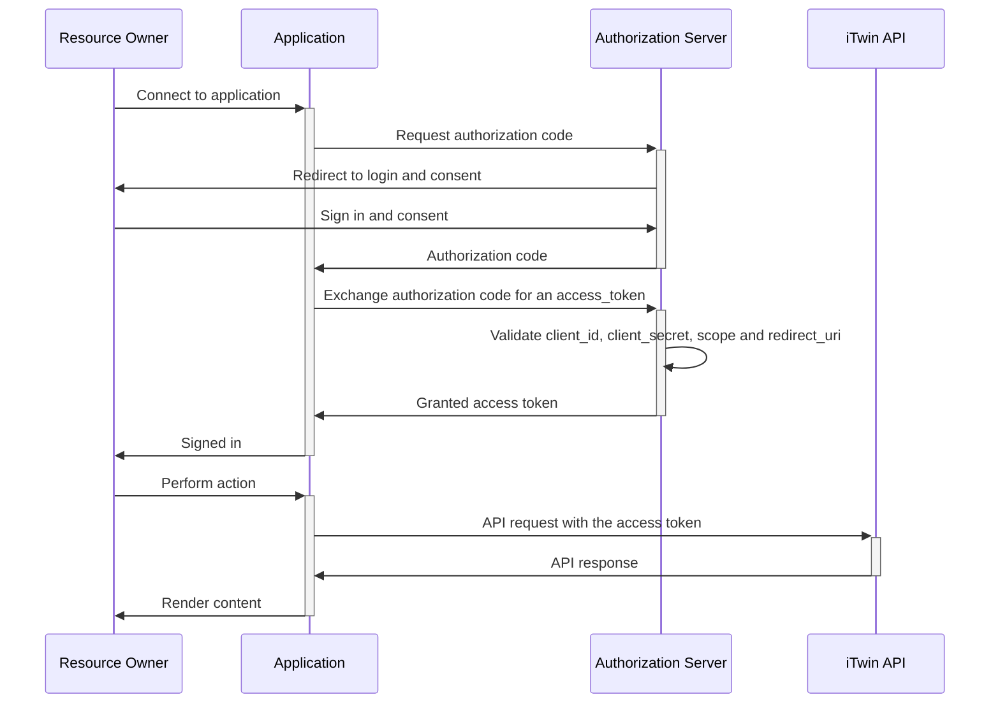
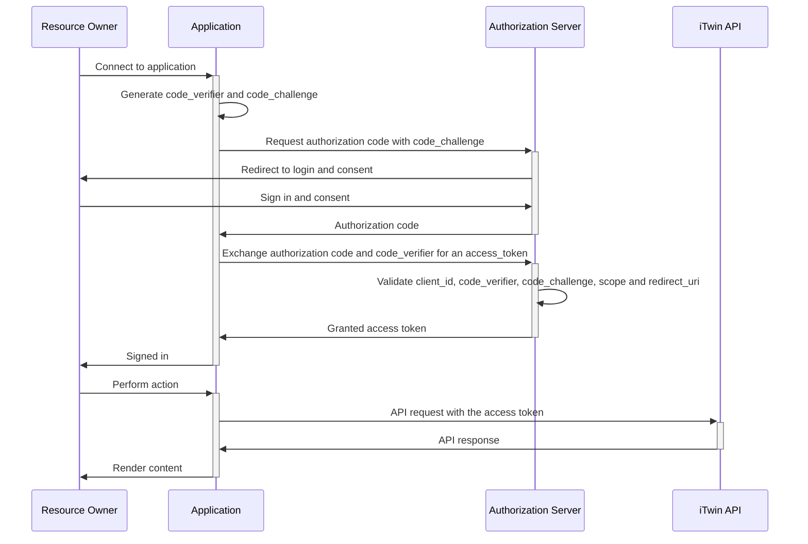

<!-- Copyright (c) Bentley Systems, Incorporated. All rights reserved.            -->
<!-- See LICENSE in the project root for license terms and full copyright notice. -->

# Authentication and Authorization

Bentley iTwin Platform APIs and SDKs use OAuth 2.0 to support authentication to the platform. The authentication process requires the end-user to consent to your application retrieving and using data on their behalf.

You must register an application to authenticate and use the iTwin Platform services. Registering your application provides basic information, including the application name and a redirect URI. A redirect URI is required for all applications that support user interaction and provides the return location for the _authorization code_ once the user has been authenticated. The authorization code is exchanged for an _access token_ used to access the service. The iTwin Platform uses access tokens of the _bearer_ type.

For detailed instructions on registering your application, see [Register and Modify an Application](https://developer.bentley.com/tutorials/register-and-modify-application/) or go straight to the [Register your application](https://developer.bentley.com/register) page in your Bentley profile.

**Note:** Service applications without user interaction do not require a redirect URI; instead, they authenticate using a _client secret_ provided registration at the end of the registration process.See the [Quickstart for Service Applications](https://developer.bentley.com/tutorials/quickstart-web-and-service-apps/) guide for instructions on setting up your service.

# Key Terminology

| Term                                   | Definition                                                                                                                                                                                                                                           |
| :------------------------------------- | :--------------------------------------------------------------------------------------------------------------------------------------------------------------------------------------------------------------------------------------------------- |
| **Access Token**                       | An access token allows one system to access the services on another system. It uses information in the token to make authenticated requests to an API to protect access to resources. Access tokens in the iTwin Platform expire after 3600 seconds. |
| **Authorization Server**               | The authorization server validates the identify of the user and issues access tokens to the application to grant access to protected resources.                                                                                                      |
| **Client**                             | A registered application attempting to access protected resources on behalf of the user.                                                                                                                                                             |
| **Client ID**                          | A unique public identifier for the application.                                                                                                                                                                                                      |
| **Client Secret**                      | A random string that is known only to the application and the authorization server. The client secret is required for authorizing _confidential clients_ to prevent the authorization server from providing tokens to rogue applications.            |
| **Confidential Client**                | Clients that maintain the confidentiality of the client secret. Typically, these clients run on a server under the control of the developer, where the source code and configuration of the application is not accessible to end-users.              |
| **Proof Key for Code Exchange (PKCE)** | Allows the calling application to dynamically generate a random, one-time key called a _code verifier_ that is used for authentication.                                                                                                              |
| **Public Client**                      | Clients without the ability to maintain the confidentiality of a client secret. These are typically desktop, mobile, and browser-based applications.                                                                                                 |
| **Redirect URI**                       | The authorization server uses the redirect URI to redirect a user back to the application with an authorization code after they have successfully authorized the application by signing in.                                                          |
| **Refresh Token**                      | A refresh token allows you to retrieve a fresh access token after it has expired without requiring the user to authenticate again. You are allows to refresh your access token for 30 days before the user must re-authenticate.                     |

# Authenticating your Applications

The workflow for authenticating an application depends on the type of application you registered. For example, as mentioned earlier, you would not want to use a client secret to authenticate a native application, as anyone can easily discover the information.

Web and Service applications use client secrets for authentication as the secret can be maintained on a backend server.

Single-page applications (SPA) and Desktop/Mobile (Native) applications use PKCE for authentication as this generates a one-time code for authentication purposes, keeping your protected resources secure.

The resources listed below guide you step-by-step through authorizing your application.

## [Authorize a web application](https://developer.bentley.com/tutorials/authorize-webapp/)

Web apps are written in a server-side framework and run on a server where the source code or configuration of the application is not available to the public. This allows the use of a client secret when communicating with the authorization server.

## [Authorize a Service Application](https://developer.bentley.com/tutorials/authorize-service/)

Service apps are designed to operate without user interaction in order to access web-hosted resourced by using the identity of an application. You may hear these referred to as two-legged authorization. Services run on a server where the source code or configuration of the application is not available to the public. This allows the use of a client secret when communicating with the authorization server.

## [Authorize a Desktop/Mobile Application](https://developer.bentley.com/tutorials/authorize-native/)

Native clients are public and do not have a dedicated backend server. As a result, native applications cannot securely store a client secret. Native applications use a Proof Key for Code Exchange (PKCE) to ensure secure access to protected resources.

## [Authorize a Single Page Application (SPA)](https://developer.bentley.com/tutorials/authorize-spa/)

As is the case with native applications, SPAs are public and do not have a dedicated backend server to safely store a client secret. SPAs use a PKCE to ensure secure access to protected resources.
